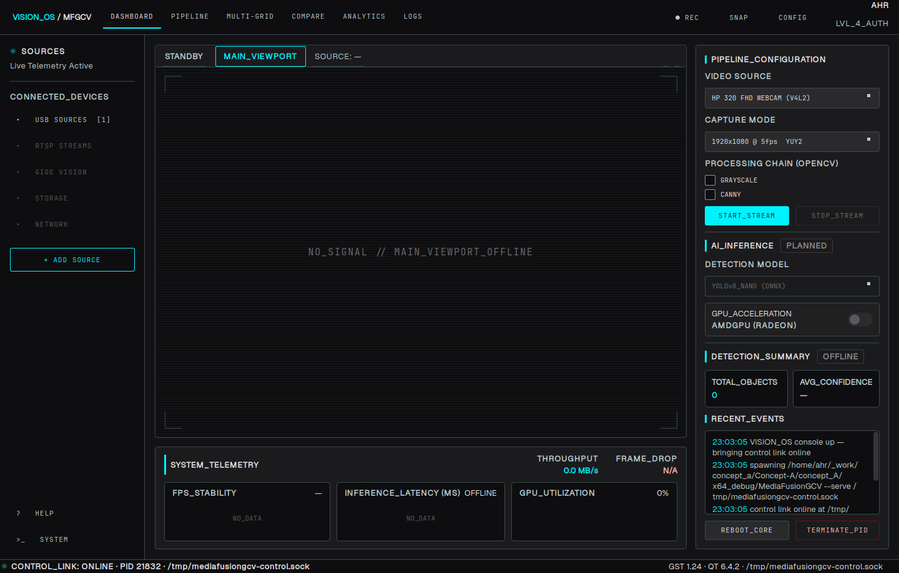
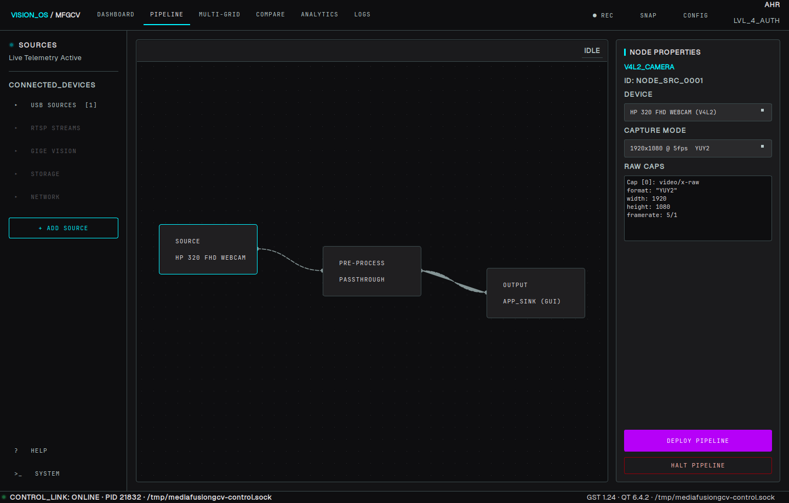
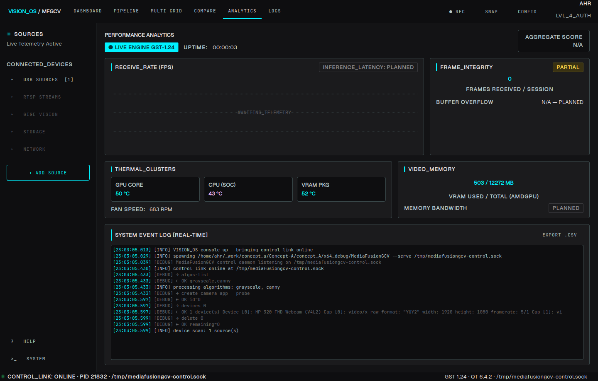
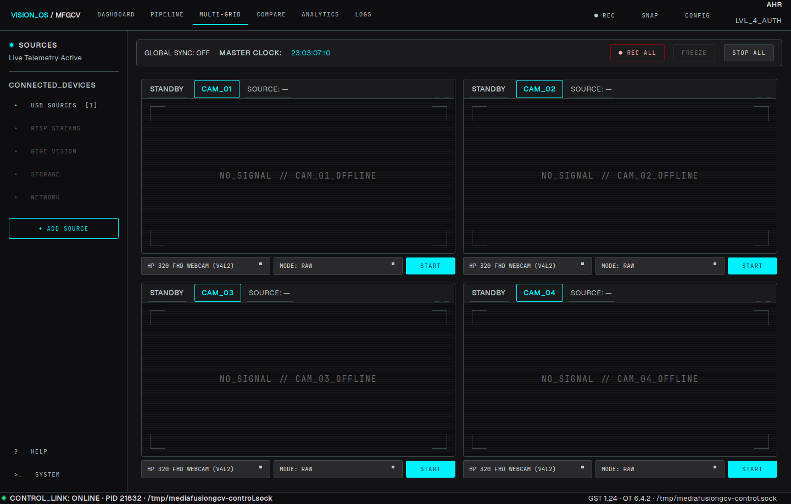
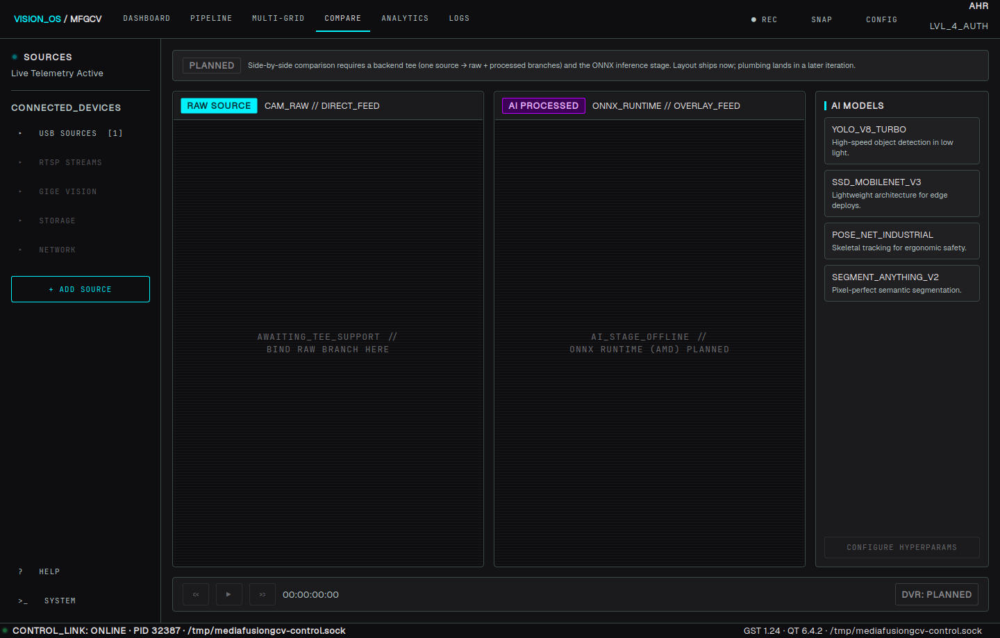
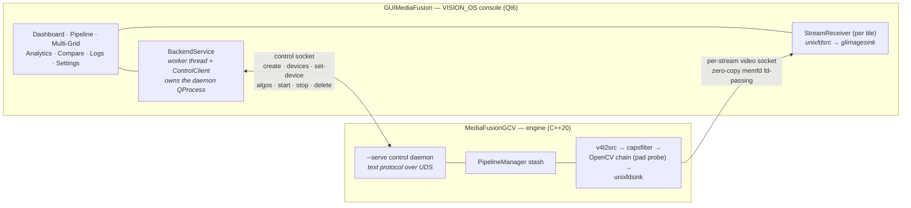

<div align="center">

# Concept-A


### MediaFusionGCV · VISION_OS

**Dynamic GStreamer media pipelines with real-time OpenCV processing —
a C++20 streaming engine driven by a Qt6 operator console over zero-copy IPC.**

[](https://github.com/ahr2042/Concept-A/actions/workflows/ci.yml)
[](https://en.cppreference.com/w/cpp/20)
[](https://www.qt.io)
[](https://gstreamer.freedesktop.org)
[](https://opencv.org)
[](#getting-started)
[](LICENSE)



*The VISION_OS operator console in standby — the daemon is spawned, the control link is online and a V4L2 camera is enumerated, one click away from streaming.*

</div>

---

## Overview

Concept-A is a two-process vision platform:

- **MediaFusionGCV** — the streaming engine. A C++20 shared library plus a standalone
  executable that owns all GStreamer logic: source/sink management, V4L2 device
  enumeration, pipeline lifecycle and an in-pipeline OpenCV processing chain. It runs
  either as an interactive REPL or as a **daemon** serving a line-based text protocol
  over a Unix-domain socket.
- **GuiMediaFusion (VISION_OS)** — the operator console. A Qt6 Widgets application that
  never links the engine; it owns the daemon's lifecycle, drives it over the control
  socket and renders live video delivered per-stream over **zero-copy** `unixfd`
  sockets (memfd + `SCM_RIGHTS` fd-passing — frames never traverse the network stack
  and are never copied between the processes).

The console is built from an industrial *command-center* design (see
[`docs/GUI_DESIGN.md`](docs/GUI_DESIGN.md)): every element of the final product vision is
laid out today, and anything the engine cannot serve yet ships as a clearly-labelled,
disabled `PLANNED` control — later iterations fill in logic, not layout. Nothing modal
interrupts operations; errors surface as log entries and tile badges.

## Feature status

> This table is the living record of the project. It is updated in the same change
> that lands a feature.

### Live today

| Area | What works |
|---|---|
| **Streaming** | Camera → viewport, end-to-end: `create → set-device → algos → start`, frames over a per-stream zero-copy unixfd socket into an embedded GL viewport |
| **Processing chain** | Runtime-selectable OpenCV algorithms (`grayscale`, `canny`, `detect`) applied in place via a pad probe — toggled live from the console |
| **AI inference** | YOLO-family ONNX object detection (`detect`) through OpenCV DNN: model picker and confidence slider in the console, boxes drawn into the frame, model swappable mid-stream. Inference runs on a worker thread and the probe overlays the newest result, so detection cost never throttles the stream |
| **Inference telemetry** | Real per-pipeline detector stats over the control protocol (`stats <id>`) — latency chart, TOTAL_OBJECTS / AVG_CONFIDENCE tiles, and detections in the event log |
| **Acceleration** | Backends auto-detected at daemon start (CPU / Vulkan / CUDA) and reported over the protocol (`accelerators`); the console renders a capability-driven selector — only detected engines are offered, `AUTO` by default, CPU when no GPU. A per-deploy CPU/GPU choice threads through the pipeline (`accel <id> <sel>`) and always resolves to a runnable backend. **The YOLO detector runs on the GPU via ncnn + Vulkan** behind an `IInferenceBackend` seam — validated on a Radeon RX 6700-series (RADV): **≈24 ms/frame vs ≈57 ms on CPU** for yolov5n at 640² (~2.4×). Enabled by `scripts/build-ncnn.sh` (`-DWITH_GPU`); the weights are converted FP16→FP32→pnnx by `scripts/fetch-models.sh` (plain `onnx2ncnn` yields a graph that crashes ncnn's Vulkan path). Colourspace convert stays on the CPU (≈1 ms). CUDA is a compiled placeholder for a future NVIDIA card |
| **Daemon control** | `MediaFusionGCV --serve <socket>`: full text protocol (create / devices / set-device / algos / start / stop / delete / list), one connection, serialized commands |
| **Daemon lifecycle** | Console auto-spawns the daemon if unreachable, restarts it (`REBOOT_CORE`) or shuts it down (`TERMINATE_PID`); crash → status LED + tiles fall back to `NO_SIGNAL` |
| **Device manager** | Camera enumeration (raw V4L2 and PipeWire providers, same-node twins deduplicated) with per-device caps (resolution / format / framerate) selection; the source element is built from the selected device; only modes the CPU pipeline can negotiate are listed (DMABuf/`DMA_DRM` import is planned) |
| **Multi-stream** | 2×2 multi-grid, one independent daemon pipeline per tile; a single camera can feed several tiles at once (PipeWire multiplexing) |
| **Telemetry** | Real per-stream FPS & throughput (sink pad probe); real host telemetry — AMD GPU temperature, VRAM, fan, GPU busy %, CPU package temp (hwmon, 1 Hz) |
| **Observability** | App-wide event log with level filters and CSV export, including the full control-protocol transcript |
| **Theming** | Generated QSS from design tokens; runtime accent-hue switching |
| **Verification** | `gstreamer-check` suite (4 suites, 25 tests) + built-in self-tests: offscreen screenshot tour and a full hardware-in-the-loop stream test; GitHub Actions builds, tests and renders every page on each push to `main` |

### Planned

| Area | What's coming | Depends on |
|---|---|---|
| **RAW vs AI compare** | Side-by-side comparison of the raw and processed branches of one source | engine `tee` support |
| **More sources** | RTSP, GigE Vision, file and test sources (protocol chips already in the rail) | engine |
| **Recording** | REC / REC ALL, freeze-frame, DVR scrubbing | engine |
| **Deeper telemetry** | Frame-integrity accounting, memory bandwidth | engine |
| **Pipeline editor** | Free node dragging & arbitrary graphs (today: fixed linear SOURCE → PROCESS → SINK, matching the engine) | engine |
| **Remote operation** | INET sockets for console and engine on different hosts | — |
| **Settings** | Network, storage and API-access panels | their features |

## Screenshots

| | |
|:---:|:---:|
| <br><sub>**Pipeline editor** — node view of the deployed chain with live device caps</sub> | <br><sub>**Analytics** — real AMD GPU/CPU/VRAM telemetry and the system event log</sub> |
| <br><sub>**Multi-grid** — four independent stream sessions with per-tile source & mode</sub> | <br><sub>**Compare** — RAW vs AI layout ships today as a labelled `PLANNED` placeholder</sub> |

<sub>The console implements the *Industrial AI Vision Platform* Stitch design system — browsable HTML mockups of the target product live in [`docs/stitch/`](docs/stitch), and [`docs/GUI_DESIGN.md`](docs/GUI_DESIGN.md) maps every design element to engine reality.</sub>

## Architecture



**Why two processes?** Isolation (a pipeline fault cannot take the console down),
a clean seam for future remote operation, and an engine that stays usable headless —
the same protocol drives it from a terminal, a script or the console.

**Why zero-copy?** `unixfdsink`/`unixfdsrc` pass file descriptors to memfd-backed
buffers instead of pixel data. A 1080p YUY2 stream moves ~4 MB per frame; over this
transport the per-frame IPC cost is a few bytes of ancillary data.

**Key engine invariant** — the OpenCV stage is an **in-place pad probe** on a BGR
`capsfilter`, *not* an appsink→appsrc bridge: hand-allocated buffers would break
`unixfdsink`'s memfd allocation negotiation downstream. New algorithms implement the
small `Algorithm` interface and register in the factory; the ONNX detector is just
another chain entry.

**Why inference is asynchronous** — a yolov5n forward pass costs ~55 ms on this CPU,
far longer than a frame interval. Running it inside the probe would turn every
detection into pipeline backpressure, so `DetectorAlgorithm` hands a frame copy to a
worker thread when that worker is idle and overlays the newest completed result.
The stream keeps the camera's frame rate, boxes lag a frame or two, and `stats`
reports inference latency and the number of frames drawn from a previous result
separately — which is why FPS and INFERENCE_LATENCY are independent readings in the
console.

**Threading rules (console)** — sockets live on a worker thread, GStreamer buses are
timer-polled (no GLib main loop), widgets are touched only on the GUI thread.

## Control protocol

One `\n`-terminated request line per command, NUL-terminated reply. Also usable
interactively: run the engine without arguments for a REPL, or
`socat - UNIX-CONNECT:/tmp/mediafusiongcv-control.sock` against a daemon.

| Command | Reply | Purpose |
|---|---|---|
| `create <src> <snk> <name>` | `OK id=N` | Allocate a pipeline (e.g. `create camera app cam0`) |
| `devices <id>` | device & caps listing | Enumerate V4L2 devices with all capture modes |
| `set-device <id> <dev> <cap>` | `OK` | Bind a device + capture mode to the source |
| `algos-list` | `OK grayscale,canny,detect` | Available processing algorithms |
| `algos <id> <csv>` | `OK` | Set the processing chain (empty CSV disables) |
| `models` | model listing | Detector models installed in `models/` |
| `model <id> [name]` | `OK <name>` | Load a detector model (no name unloads it) |
| `detect-params <id> <conf> <nms> [draw]` | `OK` | Detector thresholds and box overlay |
| `stats <id>` | stats + detections | Inference latency and the last result |
| `start <id>` | `OK <video-socket-path>` | Start streaming; reply carries the data-plane socket |
| `stop <id>` | `OK` | Stop streaming |
| `delete <id>` | `OK remaining=N` | Destroy a pipeline (**ids shift down** — clients re-map) |
| `list` | pipeline table | Active pipelines |
| `shutdown` | `OK` | Terminate the daemon |

## Getting started

### Prerequisites

Linux with GStreamer **1.24+** (the `unixfd` elements ship in `plugins-bad` since 1.24).
On Debian/Ubuntu:

```bash
sudo apt install build-essential cmake pkg-config \
     qt6-base-dev \
     libgstreamer1.0-dev libgstreamer-plugins-base1.0-dev \
     gstreamer1.0-plugins-good gstreamer1.0-plugins-bad gstreamer1.0-gl \
     libjpeg-dev libpng-dev zlib1g-dev
```

**OpenCV 4.8+** is required and Ubuntu 24.04 ships 4.6, whose ONNX importer cannot
read current YOLO exports (FP16 initializers, then an unsupported `Split` node in
the detect head). Build one — no root needed, it installs into `~/.local` and the
engine's CMake looks there first:

```bash
scripts/build-opencv.sh            # ~10 min; only the engine links OpenCV
```

Then fetch the detector weights (kept out of git):

```bash
scripts/fetch-models.sh            # yolov5n.onnx + COCO labels → models/
```

### Build

```bash
# Engine (library + executable + tests)
cmake -S concept_A/MediaFusionGCV -B concept_A/MediaFusionGCV/build
cmake --build concept_A/MediaFusionGCV/build -j

# Console
cmake -S concept_A/GuiMediaFusion -B concept_A/GuiMediaFusion/build
cmake --build concept_A/GuiMediaFusion/build -j
```

Binaries land in `concept_A/x64_debug/`.

### Run

```bash
./concept_A/x64_debug/GUIMediaFusion
```

That's it — the console connects to the control socket (`MEDIAFUSION_CTL`, default
`/tmp/mediafusiongcv-control.sock`) and spawns the engine daemon itself if none is
running. Pick a source on the Dashboard and press `START_STREAM`.

The engine also runs standalone:

```bash
./concept_A/x64_debug/MediaFusionGCV                  # interactive REPL
./concept_A/x64_debug/MediaFusionGCV --serve /tmp/mediafusiongcv-control.sock
```

### Verify

```bash
# Engine unit/integration tests (gstreamer-check)
cd concept_A/MediaFusionGCV/build && ctest

# Console: render every page offscreen to PNGs (no display needed)
QT_QPA_PLATFORM=offscreen ./concept_A/x64_debug/GUIMediaFusion --selftest-screenshot /tmp/vis

# Full hardware-in-the-loop check: daemon → camera → zero-copy socket → viewport,
# exits 0 once frames are flowing
./concept_A/x64_debug/GUIMediaFusion --selftest-stream
```

## Repository layout

```
concept_A/
├── MediaFusionGCV/          # engine: library, daemon/REPL executable, tests
│   ├── PipelineManager.*    #   pipeline lifecycle, GMainLoop thread
│   ├── FrameProcessor.*     #   in-place OpenCV chain (pad probe)
│   ├── Algorithms.*         #   Algorithm interface + factory (grayscale, canny, detect)
│   ├── Detector.*           #   ONNX object detection on a worker thread
│   ├── ModelRegistry.*      #   discovery of models/ weights + labels
│   ├── GStreamerSink*.??    #   screen (autovideosink) & app (unixfdsink) sinks
│   ├── MediaFusionGCV_API.* #   flat extern-C API over the pipeline stash
│   └── tests/               #   gstreamer-check suites
├── GuiMediaFusion/          # console: Qt6 Widgets, no engine linkage
│   ├── core/                #   BackendService, AppLog, DeviceParser, SystemMonitor
│   ├── pages/               #   Dashboard, Pipeline, MultiGrid, Analytics, …
│   ├── widgets/             #   design components, shell, VideoTile
│   ├── theme/               #   design tokens → generated QSS
│   └── StreamReceiver.*     #   unixfdsrc → glimagesink + stats probe
└── x64_debug/               # build output
models/                      # detector weights (gitignored, see scripts/)
scripts/
├── build-opencv.sh          # OpenCV 4.8+ into ~/.local (apt's 4.6 is too old)
└── fetch-models.sh          # yolov5n.onnx + COCO labels
docs/
├── GUI_DESIGN.md            # console software design & design→engine feature matrix
├── stitch/                  # browsable HTML design mockups (Stitch)
└── screenshots/             # the images in this README
```

## Roadmap

1. **Engine `tee` support** — raw + processed branches from one source, unlocking the
   Compare page and per-tile RAW/processed modes.
2. **GPU inference — done; two follow-ups.** The YOLO detector runs on ncnn + Vulkan
   (~2.4× faster than CPU, validated on a Radeon RX 6700-series). Remaining: (a) the
   GPU colour-convert segment is disabled — `glupload!glcolorconvert!gldownload`
   delivered all-black frames on this RADV/GL stack, so convert stays on the CPU;
   (b) fill in the CUDA placeholder when an NVIDIA card lands.
3. **RTSP source** — first non-V4L2 protocol chip.
4. **Recording** — REC / REC ALL to disk with the DVR transport bar.
5. **Frame-integrity accounting** — drop counters and aggregate score on Analytics.

## License

[GPL-3.0](LICENSE)
